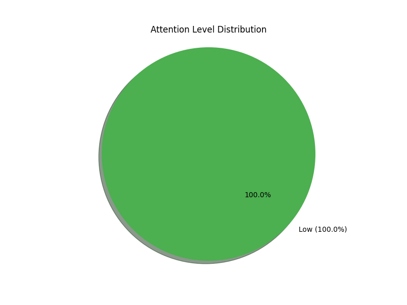

# Behavior Analysis Report for pranav

**Report Date:** 2025-04-12
**Session Duration:** 1.6 minutes
**Total Observations:** 6

## Attention Overview

### Key Findings

- **Focused Time:** 0.0%
- **Partially Engaged:** 0.0%
- **Disengaged:** 100.0%

## Detailed Analysis

### Distraction Analysis

Main sources of distraction:
- Poor posture: 3 instances (50.0%)
- Gaze undetected: 3 instances (50.0%)

### Posture Assessment

Posture data is inconclusive.

### Emotional State

Shows signs of negative emotions (66.7% of observations). Dominant emotion: fear (33.3%).

### Gaze Tracking

Mixed gaze patterns with no clear trend.

### Specific Behaviors

Behavior analysis:
- Was attentive during 100.0% of observations.

## Recommendations

1. Work on maintaining focus during class. Consider removing distractions like phones.
2. Improve sitting posture to maintain better focus and reduce fatigue.

---
*This report was automatically generated based on behavioral monitoring data.*
*For questions or concerns, please contact the instructor.*
